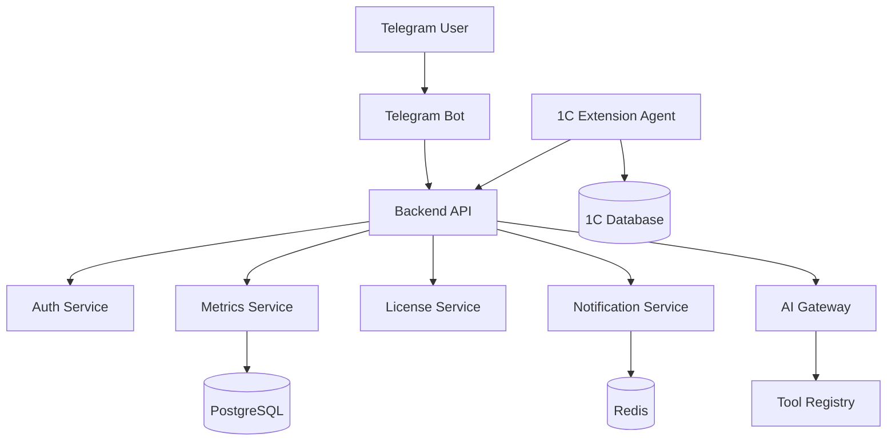

# Component Diagram

```mermaid
flowchart TD
    User[Telegram User] --> Bot[Telegram Bot]
    Bot --> API[Backend API]
    API --> Auth[Auth Service]
    API --> Metrics[Metrics Service]
    API --> License[License Service]
    API --> Notify[Notification Service]
    API --> AI[AI Gateway]
    Metrics --> DB[(PostgreSQL)]
    Notify --> Redis[(Redis)]
    AI --> Tools[Tool Registry]
    Extension[1C Extension Agent] --> API
    Extension --> OneC[(1C Database)]
```
